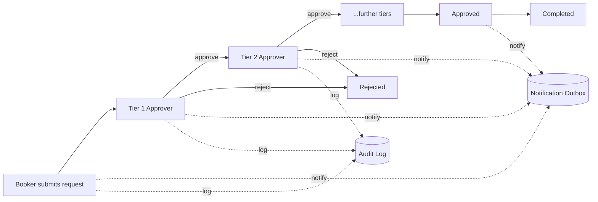
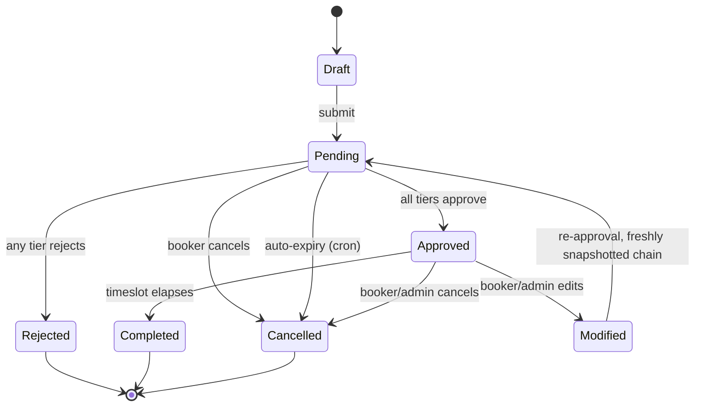
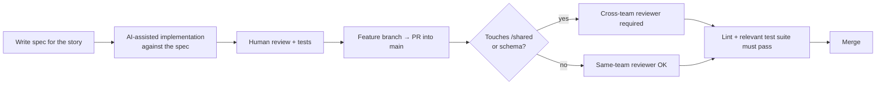

# Venue Booking System

**The single source of truth for this project.** If you're on one of the three teams and you're not sure what to do, where a file goes, or who owns a decision — the answer is in this document. If it isn't, that's a bug in this README; raise it so we can fix it for everyone else too.

Built by 18 people across 3 teams in ~6 weeks. Spec-driven, AI-assisted development: every feature starts as a written spec/contract, AI generates a first pass against it, and a human reviews and tests the result before it merges. This is **more than vibe coding, less than agentic engineering** — AI writes code against a contract we already agreed on, it doesn't invent the contract.

---

## Table of Contents

1. [What this system does](#what-this-system-does)
2. [Tech stack](#tech-stack)
3. [JS vs TypeScript — a decision the team makes](#js-vs-typescript--a-decision-the-team-makes)
4. [Monorepo structure](#monorepo-structure)
5. [Conventions](#conventions)
6. [Team ownership map](#team-ownership-map)
7. [Key design guarantees](#key-design-guarantees)
8. [Data contract & booking state machine](#data-contract--booking-state-machine)
9. [Deployment](#deployment)
10. [Getting started](#getting-started)
11. [Development workflow](#development-workflow)
12. [Suggested tooling](#suggested-tooling)
13. [FAQ / "I'm stuck"](#faq--im-stuck)

---

## What this system does

A campus venue-booking system. Four roles:

| Role | Can do |
|---|---|
| **Booker** (student/staff) | Browse venue availability, submit a booking request, track its status, receive notifications |
| **Approver** (multiple tiers) | Review requests routed to their tier, approve/reject, delegate |
| **Admin / Registrar** | Manage venues, blocks, approval chains, users; view audit log and utilization dashboards |
| **Public** (anonymous) | View venue availability only — no request, no auth |

The core flow: a Booker requests a venue for a timeslot → the request routes through a **sequential multi-tier approval chain** → every status change **notifies** the relevant people → every action is **audit-logged**, permanently.



---

## Tech stack

| Layer | Choice |
|---|---|
| Frontend | React + Vite single-page app (**not** Next.js) |
| Backend | Node.js + Express — a monolithic, long-running server |
| ORM | Prisma |
| Database | PostgreSQL in production; SQLite acceptable for local dev (via Prisma provider swap) |

**Why a plain Express monolith and not serverless/functions?** This is a deliberate, considered choice, not a default. The team has prior working experience with this exact stack (Express + Prisma + React/Vite), and for a 6-week timeline with 18 people across 3 teams, *shipping on something the team already knows* beats a theoretically more elegant architecture nobody has run before. A monolith also gives us one deployable unit, one place to reason about auth/middleware, and no cold-start or function-boundary complications for things like the cron scheduler and transactional outbox (see [Key design guarantees](#key-design-guarantees)). This is not a rejection of serverless in general — it's a fit decision for this team, this timeline, this project.

---

## JS vs TypeScript — a decision the team makes

The reference project this structure is based on was plain JavaScript. That's a real option here too, but it's worth making the tradeoff explicit rather than defaulting silently:

| | Plain JS | TypeScript |
|---|---|---|
| Time to first commit | Faster — no setup, matches prior team experience | Slower — tsconfig, build step, learning curve for anyone new to it |
| Shared contract (`/shared`) enforcement | By convention only — nothing stops client or server from drifting from it | Enforced at compile time — a client or server change that breaks the contract fails to *build*, not just to run |
| Refactor safety across teams | Lower — a renamed field in `/shared` won't show you every call site | Higher — the compiler shows you every call site across all 3 teams' code |
| Onboarding for new contributors | Simpler | Requires TS familiarity |

**Recommendation:** at minimum, write `/shared` in TypeScript, even if `client/` and `server/` stay plain JS (consuming `.d.ts`/compiled types is possible from JS via JSDoc, or the whole thing can compile down and be imported as JS). The entire point of `/shared` is to stop the three teams from silently diverging on booking fields, enums, and API shapes — TypeScript is the difference between that being a compile-time guarantee and a "please remember to check" convention. That said, **this is the team's call, not a mandate** — if everyone agrees plain JS + discipline + code review is enough for 6 weeks, that's a legitimate choice too. Whatever is decided, write it down here and don't revisit it mid-project.

---

## Monorepo structure

npm workspaces, three packages: `client`, `server`, `shared`.

```
venue-booking/
├── package.json              # workspaces root: client, server, shared + root scripts
├── package-lock.json
├── README.md                 # this file
├── CHANGE_MANAGEMENT.md      # append-only release log, one entry per production release
├── db_backups/               # pg_dump snapshots, committed before any schema/data change
├── docs/
├── client/                   # React + Vite SPA
│   ├── index.html, vite.config.js, tailwind.config.js, eslint.config.js
│   ├── .env.example           # VITE_ vars only — never commit a real .env
│   ├── public/                 # static assets
│   └── src/
│       ├── main.jsx             # entry point, mounts <App/>
│       ├── App.jsx              # route table (react-router-dom)
│       ├── components/          # shared cross-page components
│       │   └── ui/                # design-system primitives, barrel-exported via ui/index
│       ├── context/              # React Context (auth): provider, context-instance, consumer hook
│       ├── hooks/                # data-layer hooks (server state) + query-key registry
│       ├── lib/                  # apiClient, queryClient, roleHome, domain lookups
│       └── pages/                # one file per route/screen, named by role + function
├── server/                    # Express API
│   ├── package.json, .env.example
│   ├── prisma/
│   │   ├── schema.prisma        # THE FROZEN SCHEMA
│   │   ├── seed.js
│   │   └── migrations/           # one timestamped folder per migration + migration_lock.toml
│   ├── scripts/                  # e.g. stress-test script for concurrency testing
│   └── src/
│       ├── index.js              # bootstrap: helmet/CORS/compression/body parsing,
│       │                          # mounts routers, serves built SPA, error handler,
│       │                          # graceful shutdown, starts cron scheduler
│       ├── routes/               # auth.js (public) + api.js (all authenticated, role/scope-gated)
│       ├── controllers/          # one file per resource area: booking, approval, venue,
│       │                          # admin, export, profile, auth
│       ├── middleware/           # auth.js (JWT verify + RBAC + scope guards), rateLimiter.js
│       └── lib/                  # prisma client singleton, mailer, calendarInvite (.ics),
│                                  # scheduler (cron jobs)
└── shared/                    # THE FROZEN CONTRACT — Architect-owned
    # enums, entity/DTO shapes, API request/response contracts,
    # booking state-machine definition. Imported by BOTH client and server
    # so they cannot diverge. See "Key design guarantees" and
    # "Data contract & booking state machine" below.
```

> The reference internal structure this is based on lacked two things we've added deliberately: the **`/shared` contract layer** (below, it's what stops 3 teams from drifting) and a **tests/CI setup** (see [Suggested tooling](#suggested-tooling)). Both exist because we're multiple teams working in parallel, not one person who can hold the whole system in their head.

---

## Conventions

| What | Rule |
|---|---|
| React component files | `PascalCase.jsx`, one component per file, filename matches the exported component name |
| Non-component modules | `camelCase.js` (hooks, lib helpers, controllers, middleware...) |
| Folders | lowercase, singular-by-concept (`component`, not `Components`; `hook`, not `hooks-and-utils`) — matches the tree above |
| Imports | relative imports only — no path aliases (`@/...`) unless the team explicitly adopts one and documents it here |
| Environment files | `.env` is gitignored everywhere. Only `.env.example` is committed, in both `client/` and `server/`. Never commit real secrets. |

---

## Team ownership map

Ownership is **feature-sliced, vertically**, not split by layer. Each team owns its epic end-to-end — client pages, server controllers, and its slice of the shared contract — rather than "one team does all frontend."

| Team | Epic | Owns |
|---|---|---|
| **Team 1** | Data Core & Admin Console | `prisma/schema.prisma` (base schema) + core migrations · venue / booking / admin controllers · venue-management, admin, and utilization-dashboard pages |
| **Team 2** | Identity & Stakeholder Experience | Auth (Google OAuth restricted to the institutional domain, verified server-side) · auth middleware · Booker / Approver / Public portal pages · responsive UI · the `ui/` design system |
| **Team 3** | Approval Engine & Notifications | Approval-routing controller · escalation/delegation logic · cron scheduler jobs · mailer + notification outbox · audit logging · approval-chain admin |

**`/shared` and `prisma/schema.prisma` are jointly governed.** No team edits either unilaterally. Every change requires:

1. **Architect review**, and
2. A **reviewed Prisma migration** (never an ad hoc schema edit).

The schema is **frozen** outside of that process — see [How do I change the database schema?](#how-do-i-change-the-database-schema) below.

---

## Key design guarantees

These are structural guarantees, not app-level conventions — they hold even under bugs elsewhere in the codebase.

**a. No double-booking.**
Enforced by a **database-level exclusion constraint** on `(venue, timeslot range)` — overlapping bookings for the same venue are structurally impossible under concurrent requests, full stop. This is not an application-level check-then-insert (which race conditions can defeat) — it's a constraint the database itself enforces. It requires PostgreSQL's `btree_gist` extension and an exclusion constraint, added via a **raw-SQL Prisma migration** (Prisma's schema DSL doesn't express exclusion constraints natively).

**b. No lost notifications.**
A **transactional outbox**: every state change writes its notification row into an `notification_outbox` table **in the same database transaction** as the state change itself. A single cron worker reads the outbox and sends emails after commit, with retries. Result: nothing is lost (the write survives even if the mail send fails), and nothing is sent for a transaction that later rolls back (the outbox row rolls back with it).

**c. Immutable audit log.**
`audit_log` is append-only by design — no application code path updates or deletes a row in it. Every booking and approval action is recorded there permanently.

**d. Server-side authorization, always.**
Role and scope are enforced in Express middleware on **every** authenticated route. The client's view of "what can I do" is for UX only — it is never trusted as the actual authorization decision.

**e. Approval chain snapshotted at booking creation.**
When a booking is created, the approval chain that applies to it is **copied/snapshotted** onto the booking at that moment. Later edits to chain configuration (adding a tier, reordering approvers) affect only *new* bookings — in-flight bookings keep running against the chain they were created under.

---

## Data contract & booking state machine

This contract lives in **`/shared`** and is **frozen** — see [ownership](#team-ownership-map) for the change process.

### Core entities

| Entity | Purpose |
|---|---|
| `users` | Accounts, one per person, tagged with role(s) |
| `roles` | Booker / Approver / Admin — an Approver additionally has a tier |
| `venues` | Bookable spaces |
| `venue_blocks` | Recurring or one-off blackout windows on a venue (maintenance, holidays, standing reservations) |
| `approval_chains` | Ordered tier configuration — which tiers exist, in what order, for which venues/venue classes |
| `bookings` | A request for a venue over a **timeslot range**, with a status (see state machine below) |
| `approvals` | One row per tier decision on a booking (approve/reject/delegate + who + when) |
| `delegations` | An approver temporarily delegating their tier's decisions to someone else |
| `audit_log` | Append-only record of every booking/approval action |
| `notification_outbox` | Transactional outbox for notifications (see [guarantee b](#key-design-guarantees)) |

### Booking state machine



Notes:
- **Pending → Cancelled (auto-expiry)** is driven by a cron job (Team 3), not user action — a request that sits unactioned past a configured window is auto-cancelled.
- **Modified → Pending** re-enters the approval flow with a **freshly snapshotted** approval chain per [guarantee e](#key-design-guarantees) — it does not reuse the original booking's snapshot.

---

## Deployment

Two things get deployed: the SPA build, and the server.

### Single-origin SPA + API

The React SPA is built with Vite (`vite build`) and the build output is copied into the Express server's static-serve directory. Express serves the built assets **and** the API from one origin, with an SPA fallback (unmatched routes serve `index.html` so client-side routing works). This means **no separate frontend host** — one deployable unit. An optional `BASE_PATH` env var supports mounting the app under a subpath behind a reverse proxy (e.g. `/venue-booking/`).

### Server + database

Express + PostgreSQL run on a managed host or VM, process-managed (e.g. **PM2**), optionally behind a reverse proxy (nginx/Caddy) for TLS termination.

### Environment separation

Each workspace (`client/`, `server/`) has its own `.env`, gitignored, with a committed `.env.example`:

| Variable | Where | Purpose |
|---|---|---|
| `DATABASE_URL` | server | `file:./dev.db` (SQLite) locally, Postgres connection string in prod |
| `JWT_SECRET` | server | Signing secret for access/refresh tokens — `<GENERATE_A_STRONG_RANDOM_SECRET>` |
| `GOOGLE_OAUTH_CLIENT_ID` | server | OAuth client ID for the institutional Google Workspace |
| `SMTP_HOST` / `SMTP_PORT` / `SMTP_USER` / `SMTP_PASS` | server | Mailer config for the notification outbox worker |
| `PORT` | server | Port Express listens on |
| `CLIENT_ORIGIN` | server | Allowed CORS origin for local dev (client and server run on different ports before build) |
| `BASE_PATH` | server | Optional subpath for reverse-proxy mounting |
| `VITE_API_BASE_URL` | client | API base URL for local dev (client `.env` — must be prefixed `VITE_` to be exposed to the browser) |

### Mandatory pre-migration step

**Before any schema or data change**, commit a `pg_dump` snapshot into `db_backups/`. This is not optional — it's the rollback path if a migration goes wrong in a shared environment. See `CHANGE_MANAGEMENT.md` for the release log this pairs with.

---

## Getting started

### Prerequisites

- Node.js (LTS — check `package.json` engines field once set; recommend the current Node LTS)
- PostgreSQL (for anything beyond quick local iteration; SQLite works for solo local dev)

### Setup

```bash
# 1. Clone
git clone <REPO_URL>
cd venue-booking

# 2. Install all workspaces (client, server, shared) from the root
npm run install:all

# 3. Configure environment
cp client/.env.example client/.env
cp server/.env.example server/.env
# now edit both .env files with real local values

# 4. Set up the database
cd server
npx prisma migrate dev
npx prisma db seed
cd ..

# 5. Run everything
npm run dev
```

### Root scripts

| Script | Does |
|---|---|
| `npm run dev` | Runs client + server together (concurrently) |
| `npm run dev:client` | Client only |
| `npm run dev:server` | Server only |
| `npm run install:all` | Installs all workspace dependencies |

### Dev proxy note

In dev, the Vite client and the Express server run on **different ports**. Vite's dev server proxies `/api` requests through to the server port (configured in `client/vite.config.js`) so the client can call relative `/api/...` paths identically in dev and in the built single-origin production deployment. If you add a new API route and calls to it 404 only in dev, check the proxy config before anything else.

---

## Development workflow



1. **One feature branch per user story.**
2. **Spec before code.** Write (or reference) the spec/contract for the story before generating code against it. AI may write the first pass; a human reviews and tests it before it's considered done. This is the "more than vibe coding, less than agentic engineering" rule — AI fills in an agreed contract, it doesn't invent one.
3. **PR into `main`.** Must pass lint and the relevant test suite.
4. **Review.** Any team member can review same-team-owned changes. **Anything touching `/shared` or `prisma/schema.prisma` requires a cross-team reviewer** (not just someone from your own team) plus Architect sign-off — see below.
5. **Merge.**

### Changing the schema

The schema is frozen — this is the *only* path to changing it:

1. Write a short spec describing the change and why.
2. **Architect review** of the spec before any code is written.
3. A **reviewed Prisma migration** implementing it (`prisma migrate dev` locally, committed migration folder — never a manual `ALTER TABLE` against a shared environment).
4. **Regenerate/update `/shared`** so the contract reflects the new shape.
5. **Notify the other two teams** — a schema change is cross-cutting by definition; silent changes are exactly what `/shared` exists to prevent.

### Cross-team integration coordination

Because ownership is vertical (per epic) but `/shared` and the schema are horizontal (shared by all), integration friction shows up at those seams. Practical rules:
- If your story needs a field, enum value, or endpoint shape that doesn't exist in `/shared` yet, that's an Architect-review conversation, not a local workaround (see [FAQ](#faq--im-stuck)).
- Flag cross-team-impacting changes in whatever the team's shared channel is *before* opening the PR, not after — a cross-team reviewer approving a `/shared` PR cold is a worse experience for everyone than a heads-up first.

---

## Suggested tooling

**These are options for the team to pick from, not mandates.** Pick once, write the choice here, move on.

| Concern | Options | Light recommendation |
|---|---|---|
| Test runner | Vitest, or Jest | **Vitest** — pairs naturally with Vite, one config covers the client |
| API/integration testing | Supertest against the Express app | **Supertest**, paired with Vitest |
| CI | GitHub Actions: install → lint → test on every PR | Add a minimal workflow — the reference project had none, but the plan calls for explicit test gates, so this is worth the small setup cost |
| E2E (optional) | Playwright, covering login → book → approve → email | Nice-to-have if time allows; not required for the 6-week timeline |
| Client data fetching | TanStack Query, or hand-rolled fetch + hooks | **TanStack Query** — matches the query-key/cache-invalidation pattern already described for `hooks/` |
| Auth | JWT + refresh token, Google OAuth restricted to institutional domain | As specified — this one's closer to a requirement than a preference, since it's load-bearing for [guarantee d](#key-design-guarantees) |

---

## FAQ / "I'm stuck"

**Which folder does my work go in?**
Find your epic in the [team ownership map](#team-ownership-map) and follow the vertical slice — your team's pages live in `client/src/pages/`, your controllers in `server/src/controllers/`, and if your epic touches the contract, your slice of `/shared`. You should rarely be editing another team's controller or pages directly.

**How do I change the database schema?**
You don't, directly. Write a spec → get Architect review → write a reviewed Prisma migration → update `/shared` to match → tell the other teams. See [Changing the schema](#changing-the-schema). There is no ad hoc path.

**My feature needs a field that doesn't exist in the shared contract — what do I do?**
Don't add it ad hoc, even temporarily "just for now." Raise it for Architect review so the addition lands in `/shared` once, consistently, and both other teams see it at the same time you do. An ad hoc field is exactly the implicit drift `/shared` was added to prevent.

**Who owns X?**
Check the [team ownership map](#team-ownership-map) table first. If X is `/shared` or the Prisma schema, it's jointly governed — see [ownership](#team-ownership-map) and [changing the schema](#changing-the-schema).

**How do I run just the client / just the server?**
`npm run dev:client` or `npm run dev:server` from the root. `npm run dev` runs both.

**How do I add a new approval tier?**
That's **config data, not code** — approval chains (`approval_chains`) are configured through the admin console (Team 1/3 territory: approval-chain admin), not by editing controller logic. If you find yourself writing code to add a tier, stop — either the admin UI is missing a capability it should have, or you're solving the wrong problem. Raise it with Team 3.

---

*This README is the contract for how we work together, same as `/shared` is the contract for how our code talks to itself. Keep both up to date as decisions get made.*
